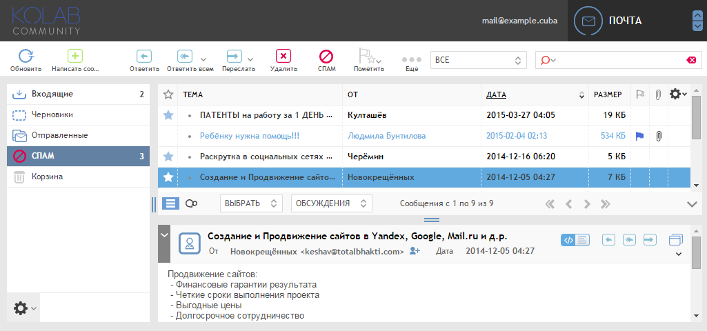

#Chameleon Blue (roundcube skin)

Chameleon Blue basically are blue customization of [Chameleon](https://git.kolab.org/diffusion/RSC/) by Kolab Community.

##Installation

Merge "skins" folder with your Roundcube instance/skins directory.

**Chameleon depends on Larry, so this skin must be installed too.**
